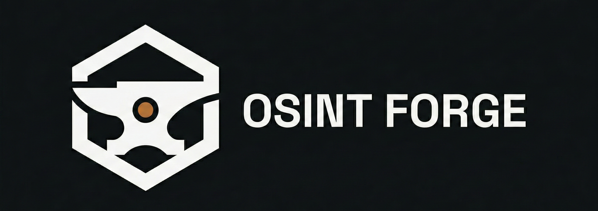

<div align="center">



**Forging open-source intelligence skills, responsibly.**

<br/>

[](https://github.com/OSINT-Forge-Community/osint-forge-docs)
[](https://github.com/OSINT-Forge-Community)
[](https://discord.gg/3A3g5hJnqd)
[](https://osint-forge.com)

<br/>

[🌐 Website](https://osint-forge.com) &nbsp;·&nbsp;
[💬 Discord](https://discord.gg/3A3g5hJnqd) &nbsp;·&nbsp;
[📬 Contact](mailto:contact@osint-forge.com) &nbsp;·&nbsp;
[🔐 Security](mailto:security@osint-forge.com) &nbsp;·&nbsp;
[🐛 Issues](https://github.com/OSINT-Forge-Community/osint-forge-docs/issues)

</div>

<br/>

---

## What is OSINT Forge?

**OSINT Forge** is an open platform dedicated to **learning, practicing, and improving Open Source Intelligence (OSINT) skills** through challenges, quests, and structured knowledge.

This repository contains **public documentation**, **community guidelines**, and **project updates**.

> **Status:** OSINT Forge is currently under **active development**. Features, content, and structure are evolving.

---

## Core Features

<table>
  <tr>
    <td align="center" width="200">
      <h3>🏆 OSINT CTF Hub</h3>
      <p>Aggregation of OSINT-focused CTFs and live events from the community.</p>
    </td>
    <td align="center" width="200">
      <h3>🧩 Quests & Challenges</h3>
      <p>Fictional or authorized datasets designed for safe, structured practice.</p>
    </td>
    <td align="center" width="200">
      <h3>📈 Progression System</h3>
      <p>XP, ranks, badges, and seasonal leaderboards to track your growth.</p>
    </td>
  </tr>
  <tr>
    <td align="center" width="200">
      <h3>🛠️ Tools & Resources</h3>
      <p>Curated OSINT tools, methods, frameworks, and workflows.</p>
    </td>
    <td align="center" width="200">
      <h3>📚 Knowledge Base</h3>
      <p>Guides, methodologies, write-ups, and best practices.</p>
    </td>
    <td align="center" width="200">
      <h3>🤝 Community Space</h3>
      <p>Discussions, peer review, shared learning, and collaborative growth.</p>
    </td>
  </tr>
</table>

---

## Core Principles

<table>
  <tr>
    <th>Principle</th>
    <th>Description</th>
  </tr>
  <tr>
    <td>⚖️ <strong>Ethical OSINT First</strong></td>
    <td>No doxxing, harassment, or targeting of private individuals. Ever.</td>
  </tr>
  <tr>
    <td>🎯 <strong>Learning by Doing</strong></td>
    <td>Practice through challenges, quests, and write-ups — not just theory.</td>
  </tr>
  <tr>
    <td>💎 <strong>Quality over Hype</strong></td>
    <td>No hacker clichés, no shortcuts, no fake expertise. Real skills only.</td>
  </tr>
  <tr>
    <td>🌍 <strong>Community-Driven</strong></td>
    <td>Knowledge grows through collaboration, contribution, and peer review.</td>
  </tr>
  <tr>
    <td>🔬 <strong>Critical Thinking</strong></td>
    <td>Methodology, source verification, and analytical thinking are central.</td>
  </tr>
</table>

---

## Ethics & Safety

> OSINT Forge is built around **responsible intelligence practice**.

**This platform is NOT:**

- ❌ A doxxing platform
- ❌ A people-search service
- ❌ A surveillance or stalking tool

**All challenges and examples are based on:**

- ✅ Fictional entities
- ✅ Explicitly authorized and public datasets

Abuse reports and security disclosures are taken seriously. See [SECURITY.md](./SECURITY.md).

---

## Project Roadmap

```
Phase 1 — Foundation & Infrastructure     ████████░░░░░░░░░░░░   In Progress
Phase 2 — Core Challenge Engine           ░░░░░░░░░░░░░░░░░░░░   Planned
Phase 3 — OSINT CTF Aggregation           ░░░░░░░░░░░░░░░░░░░░   Planned
Phase 4 — Community Onboarding            ░░░░░░░░░░░░░░░░░░░░   Planned
Phase 5 — Public Alpha Release            ░░░░░░░░░░░░░░░░░░░░   Planned
```

Public testing phases (alpha/beta) will be announced in this repository and on [Discord](https://discord.gg/3A3g5hJnqd).

---

## About This Repository

This repository is **public** and contains:

| Content | Description |
|---|---|
| 📄 Project overview & vision | High-level goals and direction of OSINT Forge |
| 📋 Community rules & ethics | Guidelines for participation and conduct |
| 🗺️ Public roadmap | Upcoming phases and milestones |
| 📣 Announcements | Major updates and news |
| 🔐 Security policy | Responsible disclosure process |

> The **core application code is private** and maintained separately.

---

## Get Involved

<table>
  <tr>
    <td align="center">
      <a href="https://discord.gg/3A3g5hJnqd">
        <strong>💬 Join the Discord</strong><br/>
        <sub>Talk, share, and learn with the community</sub>
      </a>
    </td>
    <td align="center">
      <a href="https://github.com/OSINT-Forge-Community/osint-forge-docs/issues">
        <strong>🐛 Report an Issue</strong><br/>
        <sub>Help us improve by reporting bugs</sub>
      </a>
    </td>
    <td align="center">
      <a href="mailto:security@osint-forge.com">
        <strong>🔐 Report a Vulnerability</strong><br/>
        <sub>Responsible disclosure via email</sub>
      </a>
    </td>
    <td align="center">
      <a href="mailto:contact@osint-forge.com">
        <strong>📬 Contact Us</strong><br/>
        <sub>General inquiries and partnerships</sub>
      </a>
    </td>
  </tr>
</table>

---

## Contact & Links

| Channel | Link |
|---|---|
| 🌐 Website | [osint-forge.com](https://osint-forge.com) |
| 💬 Discord | [discord.gg/3A3g5hJnqd](https://discord.gg/3A3g5hJnqd) |
| 📬 General contact | [contact@osint-forge.com](mailto:contact@osint-forge.com) |
| 🔐 Security reports | [security@osint-forge.com](mailto:security@osint-forge.com) |
| 🐛 Bug reports | [GitHub Issues](https://github.com/OSINT-Forge-Community/osint-forge-docs/issues) |

---

## Disclaimer

OSINT Forge is an independent project.
It is not affiliated with any government agency, intelligence service, or law enforcement organization.

---

<div align="center">

**OSINT Forge** — Forging open-source intelligence skills, responsibly.

[](https://github.com/OSINT-Forge-Community)
[](https://osint-forge.com)
[](https://discord.gg/3A3g5hJnqd)

</div>
